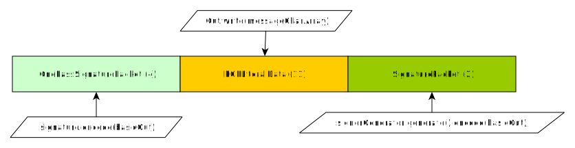

# Description

Illustrates the dump of a PGP document.

# Dependencies

* [Bouncy Castle PKIX, CMS, EAC, TSP, PKCS, OCSP, CMP, and CRMF APIs » 1.65](https://mvnrepository.com/artifact/org.bouncycastle/bcpkix-jdk15to18/1.65)
* [Bouncy Castle OpenPGP API » 1.65](https://mvnrepository.com/artifact/org.bouncycastle/bcpg-jdk15to18/1.65)

# Documentation

* [RFC 4880](https://tools.ietf.org/html/rfc4880)

# Technical notes

## Run the example

    java -cp "build/libs/app-pgp-dump-1.0-SNAPSHOT.jar:${PROJECT_ROOT_DIR}/lib/bcprov-jdk15to18-1.65.jar:${PROJECT_ROOT_DIR}/lib/bcpg-jdk15to18-1.65.jar:${PROJECT_ROOT_DIR}/lib/utils-1.0-SNAPSHOT.jar" com.beurive.Main

or

    java -cp "build\libs\app-pgp-dump-1.0-SNAPSHOT.jar;%PROJECT_ROOT_DIR%\lib\bcprov-jdk15to18-1.65.jar;%PROJECT_ROOT_DIR%\lib\bcpg-jdk15to18-1.65.jar;%PROJECT_ROOT_DIR%\lib\utils-1.0-SNAPSHOT.jar" com.beurive.Main

> Make sure to run `gradle setup` (at the project root level) first.

The program uses 1 file: `data/secret-keyring.pgp`. This file contains a sample secret key ring (passphrase is `password`).
This key ring contains 3 keys:

    List of key IDs in the secret key ring "./data/secret-keyring.pgp":
            - F52712127A58D490 (sign ? yes, master ? yes)
            - DF4C6FED0763B6A9 (sign ? yes, master ? no)
            - 1CAC39B3C005457C (sign ? no, master ? no)

The program generates 1 file: `data/signature-master.pgp`

## Code notes

See function `static public void sign(...)`

## GPG verifications

We will check that the generated signatures can be verified using GPG.

The ID of the key master key is `F52712127A58D490`.

Import this key into the GPG private and public key rings.
    
    $ gpg --import data/secret-keyring.pgp # (password: "password")
    $ gpg --import data/public-keyring.pgp

Once this is done, we must declare the master key into the GPG [trust database](https://unix.stackexchange.com/questions/407062/gpg-list-keys-command-outputs-uid-unknown-after-importing-private-key-onto). 

    & gpg --edit-key F52712127A58D490
    -> "trust" [ENTER]
    -> "5" [ENTER]
    -> "o" [ENTER]
    -> "quit" [ENTER]
    
For GPG only, you need to [cross-certify](https://gnupg.org/faq/subkey-cross-certify.html) the keys:

    $ gpg --edit-key F52712127A58D490
    -> "cross-certify" [ENTER]
    -> "quit"
    -> "y" [ENTER]

OK. Now you can verify the signatures.
    
    $ gpg --verify data/signature-master.pgp
    gpg: Note: sender requested "for-your-eyes-only"
    gpg: Signature made Wed 29 Apr 2020 04:58:30 PM CEST
    gpg:                using RSA key F52712127A58D490
    gpg:                issuer "owner@email.com"
    gpg: Good signature from "owner@email.com" [ultimate]

This signature is valid. **Therefore, the structure of the PGP document should be valid**.

Let's look at this signature document:

    $ gpg --list-packet --verbose data/signature-master.pgp
    gpg: armor header: Version: BCPG v1.65
    # off=0 ctb=a3 tag=8 hlen=1 plen=0 indeterminate
    :compressed packet: algo=2
    # off=2 ctb=90 tag=4 hlen=2 plen=13
    :onepass_sig packet: keyid F52712127A58D490
            version 3, sigclass 0x00, digest 8, pubkey 1, last=1
    # off=17 ctb=cb tag=11 hlen=2 plen=39 new-ctb
    :literal data packet:
            mode b (62), created 1588172310, name="_CONSOLE",
            raw data: 25 bytes
    # off=58 ctb=88 tag=2 hlen=2 plen=173
    :signature packet: algo 1, keyid F52712127A58D490
            version 4, created 1588172310, md5len 0, sigclass 0x00
            digest algo 8, begin of digest e4 29
            hashed subpkt 2 len 4 (sig created 2020-04-29)
            hashed subpkt 28 len 15 (signer's user ID)
            subpkt 16 len 8 (issuer key ID F52712127A58D490)
            data: 497E7E897D68C8597259100C69A16033B22EB741F6E8AC2466B3DDE7E889630D12B770732071E65E7611C8D90F5A9D2307DDEFCC0182B73F76E9CF388B4066484C64EC9FE234EDD95B0ED8B2E734DDCC9207925F70F5EE9FA678BAB6FEC52C64748E18B52822EADCA24D03C9115BD9BD501008AC06858B11599CFBF9B6BF18B5

We have 3 packets:

* A [One-Pass Signature Packet](https://tools.ietf.org/html/rfc4880#section-4.3) - tag = 4
* A [Literal Data Packet](https://tools.ietf.org/html/rfc4880#section-4.3) - tag = 11
* A [Signature Packet](https://tools.ietf.org/html/rfc4880#section-4.3) - tag = 2

However, when we run the program, we get:

    $ java -cp "build/libs/app-pgp-dump-1.0-SNAPSHOT.jar:${PROJECT_ROOT_DIR}/lib/bcprov-jdk15to18-1.65.jar:${PROJECT_ROOT_DIR}/lib/bcpg-jdk15to18-1.65.jar:${PROJECT_ROOT_DIR}/lib/utils-1.0-SNAPSHOT.jar" com.beurive.Main
    List of key IDs in the secret key ring "./data/secret-keyring.pgp":
            - F52712127A58D490 (sign ? yes, master ? yes)
            - DF4C6FED0763B6A9 (sign ? yes, master ? no)
            - 1CAC39B3C005457C (sign ? no, master ? no)
    Sign <This the document to sign> using the master key => "./data/signature-master.pgp".
    Tags for the PGP document "./data/signature-master.pgp":
      - [1] tag = 4
      - [2] tag = 11
      - [3] tag = 20
    java.io.IOException: invalid header encountered
            at org.bouncycastle.bcpg.BCPGInputStream.readPacket(Unknown Source)
            at com.beurive.Main.listPacketTags(Main.java:244)
            at com.beurive.Main.main(Main.java:274)

20 = b00010100

The whole document is:

    90 0D 03 00 08 01 F5 27 12 12 7A 58 D4 90 01 CB  | .......'..zX....
    27 62 08 5F 43 4F 4E 53 4F 4C 45 5E AA ED 37 54  | 'b._CONSOLE^..7T
    68 69 73 20 74 68 65 20 64 6F 63 75 6D 65 6E 74  | his the document
    20 74 6F 20 73 69 67 6E 88 AD 04 00 01 08 00 17  |  to sign........
    05 02 5E AA ED 37 10 1C 6F 77 6E 65 72 40 65 6D  | ..^..7..owner@em
    61 69 6C 2E 63 6F 6D 00 0A 09 10 F5 27 12 12 7A  | ail.com.....'..z
    58 D4 90 B1 BF 04 00 A9 55 E3 8F E9 60 B1 38 42  | X.......U...`.8B
    C1 D7 2B 50 48 5B A8 30 F4 A8 18 B4 1D 6C 73 8C  | ..+PH[.0.....ls.
    00 4D D3 B7 41 44 8E 06 27 72 B8 DD DC 05 E3 FB  | .M..AD..'r......
    46 48 45 3B B2 AF 82 C9 73 C1 DC CD AD 89 01 91  | FHE;....s.......
    07 10 AD 46 DD BD 99 32 E0 4C E0 1E 78 0D 09 4D  | ...F...2.L..x..M
    0C BA 3D 14 C4 37 FD 17 92 BF D8 87 24 57 ED CF  | ..=..7......$W..
    BE 17 F9 04 91 B3 1E ED 91 FE B9 DA 40 4C B0 7B  | ............@L.{
    7A 00 28 C6 77 49 58 16 62 5E 7C 9F 52 A0 64 28  | z.(.wIX.b^|.R.d(
    41 5D 66 50 50 7A 96                             | A]fPPz.

The first 2 tags are correctly recognized. Thus we can eliminate some bytes.
We must search in the following bytes (see [this document](../doc/pgp-packet.md)):

       62 08 5F 43 4F 4E 53 4F 4C 45 5E AA ED 37 54
    68 69 73 20 74 68 65 20 64 6F 63 75 6D 65 6E 74
    20 74 6F 20 73 69 67 6E 88 AD 04 00 01 08 00 17
    05 02 5E AA ED 37 10 1C 6F 77 6E 65 72 40 65 6D
    61 69 6C 2E 63 6F 6D 00 0A 09 10 F5 27 12 12 7A
    58 D4 90 B1 BF 04 00 A9 55 E3 8F E9 60 B1 38 42
    C1 D7 2B 50 48 5B A8 30 F4 A8 18 B4 1D 6C 73 8C
    00 4D D3 B7 41 44 8E 06 27 72 B8 DD DC 05 E3 FB
    46 48 45 3B B2 AF 82 C9 73 C1 DC CD AD 89 01 91
    07 10 AD 46 DD BD 99 32 E0 4C E0 1E 78 0D 09 4D
    0C BA 3D 14 C4 37 FD 17 92 BF D8 87 24 57 ED CF
    BE 17 F9 04 91 B3 1E ED 91 FE B9 DA 40 4C B0 7B
    7A 00 28 C6 77 49 58 16 62 5E 7C 9F 52 A0 64 28
    41 5D 66 50 50 7A 96 

Since 20 (b00010100) needs 5 bits to be encoded, it must appear on a new packet format header.

We must find all bytes that end with `10100` => `xxx10100`.
And, among all these bytes, we select the ones that start with `110` (new packet format).
=> `b11010100 = 0xD4`.

We are looking for `D4`:

     90   0D   03   00   08   01   F5   27   12   12   7A   58  =D4=  90   01   CB   | .......'..zX....
     27   62   08   5F   43   4F   4E   53   4F   4C   45   5E   AB   04   4F   54   | 'b._CONSOLE^..OT
     68   69   73   20   74   68   65   20   64   6F   63   75   6D   65   6E   74   | his the document
     20   74   6F   20   73   69   67   6E   88   AD   04   00   01   08   00   17   |  to sign........
     05   02   5E   AB   04   4F   10   1C   6F   77   6E   65   72   40   65   6D   | ..^..O..owner@em
     61   69   6C   2E   63   6F   6D   00   0A   09   10   F5   27   12   12   7A   | ail.com.....'..z
     58  =D4=  90   FE   D3   03   FF   6A   5A   CF   ED   0A   78   86   5B   A7   | X......jZ...x.[.
     B0   7D   F7   08   AB   B1   8D   BB   AC   A2   93   A6   9D   08   27   AC   | .}............'.
     56   BE   50   19   87   20   55   1F   5A   01   2A   88   41   C1   62   17   | V.P.. U.Z.*.A.b.
     0A   D2   BE   EC   47   B7   66   BC   6D   66   8B   83   83   3C   02   32   | ....G.f.mf...<.2
     8B   BC   ED   AA   2D   49   9E   DE   EA   17   81   71   E8   70   E1   65   | ....-I.....q.p.e
     51   35   41   42   24   60   1A   EF   A8   26   BA   F0   A7   DF   7F   10   | Q5AB$`...&......
     C2   30   2A   F6   25   CA   41   7F   54   07   2A   05   19   E2   C4   58   | .0*.%.A.T.*....X
     C8   BD   06   DC   C4   0A   A7   B3   AB   AB   2C   76   FF   3D   5E   7E   | ..........,v.=^~
     E2   21   5B   65   51   1E   FA                                                | .![eQ..

The second `D4` is the only one that can be the one we are looking for.

We have 41 bytes in excess in the second packet (as far as BC sees it):

                                             88   AD   04   00   01   08   00   17
     05   02   5E   AB   04   4F   10   1C   6F   77   6E   65   72   40   65   6D
     61   69   6C   2E   63   6F   6D   00   0A   09   10   F5   27   12   12   7A
     58  

