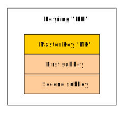
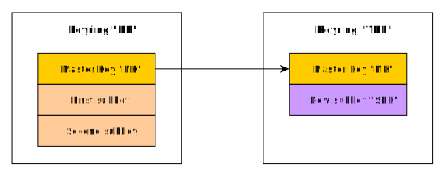
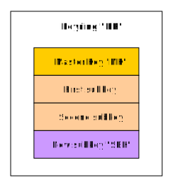

# Description

Illustrates the generation of the PGP keys and key rings.

# Dependencies

* [Bouncy Castle PKIX, CMS, EAC, TSP, PKCS, OCSP, CMP, and CRMF APIs » 1.65](https://mvnrepository.com/artifact/org.bouncycastle/bcpkix-jdk15to18/1.65)
* [Bouncy Castle OpenPGP API » 1.65](https://mvnrepository.com/artifact/org.bouncycastle/bcpg-jdk15to18/1.65)

# Documentation

* [RFC 4880](https://tools.ietf.org/html/rfc4880)

# Technical notes

## Build the code for BC version 1.65

Edit [this code](src/main/java/com/beurive/Main.java) and make sure that:

    private static final boolean ENABLE_BETA_166b07 = false;
    
## Build the code for BC BETA version 166b07

Edit [this code](src/main/java/com/beurive/Main.java) and make sure that:

    private static final boolean ENABLE_BETA_166b07 = true;

## Run the example

    export MAIN=build/libs/app-pgp-keygen-1.0-SNAPSHOT.jar
    java -cp "${CLASSPATH}:${MAIN}" com.beurive.Main

or

    SET MAIN=build\libs\app-pgp-keygen-1.0-SNAPSHOT.jar
    java -cp "%CLASSPATH%;%MAIN%" com.beurive.Main

> **WARNING**
>
> Before you execute one of the commands given ahead, make sure to follow this procedure:
>
> * run `gradle setup` (at the project root level). This will create the files `setup.bat` and `setup.sh`.
> * Depending on the OS:
>   * Windows: execute `setup.bat`.
>   * Unix (linux, Mac...): execute `setup.sh`.
>
> These scripts set the CLASSPATH environment variable.

# General notes

Sub-keys of type DSA cannot be "[cross-certified](../doc/cross-certify.md)" using GPG 2.2.19.

What is the _key ID_ ? In PGP, most keys are created in such a way so that what is called the "key ID" is equal to the
lower 32 or 64 bits respectively of a key fingerprint. PGP uses key IDs to refer to public keys for a variety of purposes.

You may get the exception "`only SHA1 supported for key checksum calculations`".

Recent versions of PGP and GnuPG can protect the integrity of secret keys with a 20 byte SHA1
hash instead of the older 2 byte (16 bit) checksum used by previous versions of PGP and GnuPG.
This new SHA1 secret key hash is specifed in RFC2440; the simple 16 bit checksum used by most
previous versions of PGP and GPG is now deprecated.  

# Note about the creation of subkeys

[Public-Subkey Packet (Tag 14)](https://tools.ietf.org/html/rfc4880#section-5.5.1.2): A Public-Subkey packet (tag 14)
has **exactly the same format** as a Public-Key packet, but denotes a subkey.

[Secret-Subkey Packet (Tag 7)](https://tools.ietf.org/html/rfc4880#section-5.5.1.4): A Secret-Subkey packet (tag 7) is
the subkey analog of the Secret Key packet and has **exactly the same format**.

In other words, through a structural analyze, the only thing that differentiates a subkey from a key is the tag's value:

|        | Public | Secret |
|--------|--------|--------|
| key    | 6      | 5      |
| subkey | 14     | 7      |

## BC version 1.65 only

> **IMPORTANT**
>
> Please note that what follows applies for version `1.65` of BC.
> Beta version [166b07](https://downloads.bouncycastle.org/betas/) provides a way to create a subkey without the use of a keyring. 

A keyring is made of one master key and, optionally, one or more subkeys. 

Keyrings are created using a keyring generator (`org.bouncycastle.openpgp.PGPKeyRingGenerator`).

The technique implemented in this example uses a keyring generator to generate a subkey.

Let's say that:
* we want to generate a subkey for the keyring "KR".
* the master key of the "KR" keyring is "MK".

First, we initialize a keyring generator (let's call it "KRG") with 2 key pairs:
* the first key pair is built using "MK".
* the second key pair is generated (using a key pai generator).

Then, we generate a temporary keyring (let's call it "TKR") using the previously created keyring generator ("KRG").
"TKR" contains:
* the master key "MK".
* the new subkey, designed to be added to "KR". Let's call this subkey "SBK".

Finally, we extract "SBK" from "TKR" and we add it to "KR".

## BC BETA version 166b07

It is not necessary to create a temporary keyring in order to generate a subkey.

See methods:

* [com.beurive.Main#createSigningSubKey](src/main/java/com/beurive/Main.java)
* [com.beurive.Main#createEncryptionSubKey](src/main/java/com/beurive/Main.java)

# Documents

* [java sign public pgp key with bouncycastle](https://stackoverflow.com/questions/28591684/java-sign-public-pgp-key-with-bouncycastle)
* [PGP keys, software security, and much more threatened by new SHA1 exploit](https://arstechnica.com/information-technology/2020/01/pgp-keys-software-security-and-much-more-threatened-by-new-sha1-exploit/)
* [SHA256 RSAkeyPairGenerator #200](https://github.com/bcgit/bc-java/issues/200)
* [GnuPG 2.2.18 released](https://lists.gnupg.org/pipermail/gnupg-devel/2019-November/034487.html)
