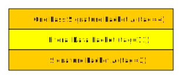
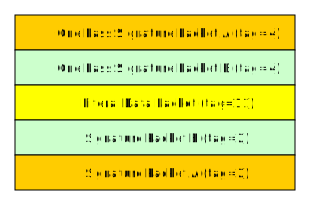

# Description

Illustrates the signature management.

# Dependencies

* [Bouncy Castle PKIX, CMS, EAC, TSP, PKCS, OCSP, CMP, and CRMF APIs » 1.65](https://mvnrepository.com/artifact/org.bouncycastle/bcpkix-jdk15to18/1.65)
* [Bouncy Castle OpenPGP API » 1.65](https://mvnrepository.com/artifact/org.bouncycastle/bcpg-jdk15to18/1.65)

# Documentation

* [RFC 4880](https://tools.ietf.org/html/rfc4880)

# Technical notes

## Run the example

    export MAIN=build/libs/app-pgp-sign-1.0-SNAPSHOT.jar
    java -cp "${CLASSPATH}:${MAIN}" com.beurive.Main

or

    SET MAIN=build\libs\app-pgp-sign-1.0-SNAPSHOT.jar
    java -cp "%CLASSPATH%;%MAIN%" com.beurive.Main

> **WARNING**
>
> Before you execute one of the commands given ahead, make sure to follow this procedure:
>
> * run `gradle setup` (at the project root level). This will create the files `setup.bat` and `setup.sh`.
> * Depending on the OS:
>   * Windows: execute `setup.bat`.
>   * Unix (linux, Mac...): execute `setup.sh`.
>
> These scripts set the CLASSPATH environment variable.

## Execution

> The program uses key rings that have been generated by the application [app-pgp-keygen](../app-pgp-sign):
> * `data/public-keyring.pgp`
> * `data/secret-keyring.pgp`

The program generates 6 files:
* `data/signature-master.pgp`
* `data/signature-subkey.pgp`
* `data/signature-subkey-bis.pgp`
* `data/detached-signature-master.pgp`
* `data/detached-signature-subkey.pgp`
* `data/resig-signature-master.pgp`

> `data/signature-subkey.pgp` and `data/signature-subkey-bis.pgp` are identical.

The files `data/signature-master.pgp` and `data/signature-subkey.pgp` contain 1 [One Pass Signature Packet (tag=4)](https://tools.ietf.org/html/rfc4880#section-5.4).

The files `data/detached-signature-master.pgp` and `data/detached-signature-subkey.pgp` contain 1 [Signature Packet (tag=2)](https://tools.ietf.org/html/rfc4880#section-11.4).

The file `data/resig-signature-master.pgp` contains 2 [One Pass Signature Packets (tag=4)](https://tools.ietf.org/html/rfc4880#section-5.4).

Sample output:

    List of key IDs in the key ring "./data/secret-keyring.pgp":
            - F52712127A58D490 (sign ? yes, master ? yes)
            - DF4C6FED0763B6A9 (sign ? yes, master ? no)
            - 1CAC39B3C005457C (sign ? no, master ? no)
    Sign <Message to sign> using the master key => "./data/signature-master.pgp".
    Sign <Message to sign> using a sub key [DF4C6FED0763B6A9] => "./data/signature-subkey.pgp".
    Sign <Message to sign> using a sub key [DF4C6FED0763B6A9] => "./data/signature-subkey-bis.pgp".
    Detach sign <./data/document-to-sign.txt> using the master key => "./data/detached-signature-master.pgp".
    Detach sign <./data/document-to-sign.txt> using the sub key [DF4C6FED0763B6A9] => "./data/detached-signature-subkey.pgp".
    Re-sign <./data/document-to-sign.txt> using the sub key [F52712127A58D490] => "./data/resig-signature-master.pgp".
    The signature "./data/signature-master.pgp" is valid.
    The signature "./data/signature-subkey.pgp" is valid.
    The signature "./data/detached-signature-master.pgp" is valid.
    The signature "./data/detached-signature-subkey.pgp" is valid.

## GPG verifications

We will check that the generated signatures can be verified using GPG.

* The ID of the key master key is `F52712127A58D490`.
* The ID of the sub key is `DF4C6FED0763B6A9`.

Import this key into the GPG private and public key rings.
    
    $ gpg --import data/secret-keyring.pgp # (password: "password")
    $ gpg --import data/public-keyring.pgp

Once this is done, we must declare the master key and the subkey into the GPG [trust database](https://unix.stackexchange.com/questions/407062/gpg-list-keys-command-outputs-uid-unknown-after-importing-private-key-onto). 

    & gpg --edit-key F52712127A58D490
    -> "trust" [ENTER]
    -> "5" [ENTER]
    -> "o" [ENTER]
    -> "quit" [ENTER]
    
    & gpg --edit-key DF4C6FED0763B6A9
    -> "trust" [ENTER]
    -> "5" [ENTER]
    -> "o" [ENTER]
    -> "quit" [ENTER]
    
For GPG only, you need to [cross-certify](https://gnupg.org/faq/subkey-cross-certify.html) the keys:

    $ gpg --edit-key F52712127A58D490
    -> "cross-certify" [ENTER]
    -> "quit"
    -> "y" [ENTER]

OK. Now you can verify the signatures.
    
    gpg --verify data/signature-master.pgp

    gpg --verify data/signature-subkey.pgp

For the detached signature:
        
    gpg --verify data/detached-signature-master.pgp data/document-to-sign.txt

    gpg --verify data/detached-signature-subkey.pgp data/document-to-sign.txt

For the double signature:

    gpg --verify data/resig-signature-master.pgp

# Documents

* [Is there a size restriction on signatures in Java (java.security)?](https://stackoverflow.com/questions/2678138/is-there-a-size-restriction-on-signatures-in-java-java-security)
