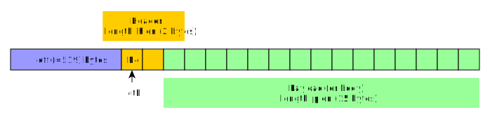

# GPG

## Path to PGP files

Under Windows:

    %USERPROFILE%\AppData\Roaming\gnupg

## Generate keys

    gpg --full-generate-key

Result:    
    
    pub   rsa2048 2020-04-21 [SC]
          CD3587D3EFCC69B115CACC38FD46A5EFC8368BBF
    uid                      Denis <denis@email.com>
    sub   rsa2048 2020-04-21 [E]

## List the secret keys

    gpg --list-secret-keys --keyid-format LONG

Result:

    sec   rsa512/D09BA342BB8D5F37 2020-04-17 [SCEA]
          3ACAAB30B1FF6D2C68F0B23ED09BA342BB8D5F37
    uid                [ inconnue] denis@email.com
    ssb   dsa512/767118C95940A332 2020-04-17 [SCA]
    ssb   elg512/5338FDFC2F78590A 2020-04-17 [E]
    
    sec   rsa2048/FD46A5EFC8368BBF 2020-04-21 [SC]
          CD3587D3EFCC69B115CACC38FD46A5EFC8368BBF
    uid                [  ultime ] Denis <denis@email.com>
    ssb   rsa2048/9EE198EFB477D01B 2020-04-21 [E]

With (see [this link](https://unix.stackexchange.com/questions/31996/how-are-the-gpg-usage-flags-defined-in-the-key-details-listing)):

| Meaning             | Code |
|---------------------|------|
| `PUBKEY_USAGE_SIG`  | S    |
| `PUBKEY_USAGE_CERT` | C    |
| `PUBKEY_USAGE_ENC`  | E    |
| `PUBKEY_USAGE_AUTH` | A    |

> See also [Key Flags subpacket](pgp-subpacket/subpacket-key-flags.md).

## Add a key into the GPG key rings

    $ gpg --edit-key ${KEYID}
    -> "trust" [ENTER]
    -> "5" [ENTER]
    -> "o" [ENTER]
    -> "quit" [ENTER]

## Cross certify a key

    $ gpg --edit-key ${KEYID}
    -> "cross-certify" [ENTER]
    -> "quit" [ENTER]
    -> "y" [ENTER]

## Export a key

### Public key

    gpg --armor --output pub.key --export FD46A5EFC8368BBF 
    gpg --list-packets --verbose pub.key

### Secret key

    gpg --armor --output sec.key --export-secret-keys FD46A5EFC8368BBF
    gpg --list-packets --verbose sec.key

## Sign a document

    gpg --default-key FD46A5EFC8368BBF --output data/doc.sig --sign data/document-to-sign.txt

## Verify a signed document

    gpg --verify data/doc.sig

## Detach-sign a document

    gpg --default-key FD46A5EFC8368BBF --output data/doc.sig --detach-sig data/document-to-sign.txt
    
## Verify a detached-signature

    gpg --verify data/doc.sig data/document-to-sign.txt
    
## Delete all keys
    
    gpg --list-secret-keys --keyid-format LONG
    
    gpg --delete-secret-key "User Name"

## Dumping a PGP document

    gpg --list-packets --verbose document.pgp
    
Output example:

    # off=519 ctb=b4 tag=13 hlen=2 plen=15
    :user ID packet: "owner@email.com"

## Create a (master) key revocation certificate

    gpg -o revocation-cert.pgp --gen-revoke ${KEYID}
    
## Create a subkey key revocation certificate

Be aware that a subkey revocation certificate is, in reality, a keyring that contains additional data.
The additional data is a special type of signature (tag=2) which type is _Subkey Revocation Signature_ (type=0x28).

* Let's assume that `D09BA342BB8D5F37` is the ID of the "keyring master key" (also called "master key" or "key"...).
* Let's assume that `FD46A5EFC8368BBF` is the ID of the "subkey" to revoke.

Edit the key (or "keyring", or "master key"):

    gpg --edit-key D09BA342BB8D5F37
    
Then **SELECT THE (SUBKEY) to revoke**:

    key FD46A5EFC8368BBF [ENTER]

> The command above is **VERY IMPORTANT**. If you don't select the subkey, then you will revoke the
> See [edit-key](https://www.gnupg.org/gph/en/manual/r899.html).
> "master key" (or "keyring", or "key") => all the "keys", including the subkeys.

    "revkey" [ENTER]
    ...
    [save] [ENTER]
    
At the end, you should export the (public) keyring (which _IS_ the revocation certificate):

    gpg --armor --output revocation-certificate-for-subkey-FD46A5EFC8368BBF.pgp --export D09BA342BB8D5F37

## Sign a key

    gpg --sign-key -u <signer key ID> --default-cert-level <certification level> <signed key ID>
    
Where:

* `signer key ID` is the ID of the key used to sign.
* `signed key ID` is the ID of the key being signed.
* `certification level` is the cerifictation level, as defined [here](https://www.gnupg.org/documentation/manuals/gnupg/GPG-Configuration-Options.html).
