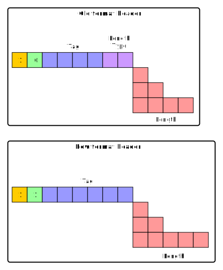

# Anatomy of a packet

A packet is made of:

* a header
* a payload

See [FRC 4880 - 4.2. Packet Headers](https://tools.ietf.org/html/rfc4880#section-4.2)

              +---------------+
         PTag |7 6 5 4 3 2 1 0|
              +---------------+
         Bit 7 -- Always one
         Bit 6 -- New packet format if set
         
Old format packets contain:

         Bits 5-2 -- packet tag
         Bits 1-0 -- length-type

New format packets contain:

         Bits 5-0 -- packet tag

Example of packet (this is a signature):

    90 0D 03 00 08 01 F5 27 12 12 7A 58 D4 90 01 CB  | .......'..zX....
    27 62 08 5F 43 4F 4E 53 4F 4C 45 5E AA ED 37 54  | 'b._CONSOLE^..7T
    68 69 73 20 74 68 65 20 64 6F 63 75 6D 65 6E 74  | his the document
    20 74 6F 20 73 69 67 6E 88 AD 04 00 01 08 00 17  |  to sign........
    05 02 5E AA ED 37 10 1C 6F 77 6E 65 72 40 65 6D  | ..^..7..owner@em
    61 69 6C 2E 63 6F 6D 00 0A 09 10 F5 27 12 12 7A  | ail.com.....'..z
    58 D4 90 B1 BF 04 00 A9 55 E3 8F E9 60 B1 38 42  | X.......U...`.8B
    C1 D7 2B 50 48 5B A8 30 F4 A8 18 B4 1D 6C 73 8C  | ..+PH[.0.....ls.
    00 4D D3 B7 41 44 8E 06 27 72 B8 DD DC 05 E3 FB  | .M..AD..'r......
    46 48 45 3B B2 AF 82 C9 73 C1 DC CD AD 89 01 91  | FHE;....s.......
    07 10 AD 46 DD BD 99 32 E0 4C E0 1E 78 0D 09 4D  | ...F...2.L..x..M
    0C BA 3D 14 C4 37 FD 17 92 BF D8 87 24 57 ED CF  | ..=..7......$W..
    BE 17 F9 04 91 B3 1E ED 91 FE B9 DA 40 4C B0 7B  | ............@L.{
    7A 00 28 C6 77 49 58 16 62 5E 7C 9F 52 A0 64 28  | z.(.wIX.b^|.R.d(
    41 5D 66 50 50 7A 96                             | A]fPPz.

**First packet**

Header: `900D`

    0x90 => b10010000
    [6]   0     packet format = 0 => old packet format
    [5-2] 0100  packet tag    = 4 => One-Pass Signature Packet
    [1-0] 00    length-type   = 0 => The packet has a one-octet length.  The header is 2 octets long.
                                     0x0D => length = 13
                                     
Payload:
                                     
    Payload: 03 00 08 01 F5 27 12 12 7A 58 D4 90 01

**Second packet**

Header: `CB27`

    0xCB => b11001011
    [0]   1        packet format = 1  => new packet format
    [5-0] 001011   packet tag    = 11 => Literal Data Packet
     
The next byte is `0x27 = 39`

See [REF 4880 - 4.2.2. New Format Packet Lengths](https://tools.ietf.org/html/rfc4880#section-4.2.2):

> A one-octet Body Length header encodes packet lengths of up to 191 octets.

Thus, the length of the payload is: 39 bytes.

Payload:

       62 08 5F 43 4F 4E 53 4F 4C 45 5E AA ED 37 54
    68 69 73 20 74 68 65 20 64 6F 63 75 6D 65 6E 74
    20 74 6F 20 73 69 67 6E

**Third packet**

Header: `88AD`

    0x88 => b10001000
    [6]   0     packet format = 0 => old packet format
    [5-2] 0010  packet tag    = 2 
    [1-0] 00    length type   = The packet has a one-octet length.  The header is 2 octets long.
                                0xAD => length = 173
    
Payload:

                                  04 00 01 08 00 17
    05 02 5E AA ED 37 10 1C 6F 77 6E 65 72 40 65 6D
    61 69 6C 2E 63 6F 6D 00 0A 09 10 F5 27 12 12 7A
    58 D4 90 B1 BF 04 00 A9 55 E3 8F E9 60 B1 38 42
    C1 D7 2B 50 48 5B A8 30 F4 A8 18 B4 1D 6C 73 8C
    00 4D D3 B7 41 44 8E 06 27 72 B8 DD DC 05 E3 FB
    46 48 45 3B B2 AF 82 C9 73 C1 DC CD AD 89 01 91
    07 10 AD 46 DD BD 99 32 E0 4C E0 1E 78 0D 09 4D
    0C BA 3D 14 C4 37 FD 17 92 BF D8 87 24 57 ED CF
    BE 17 F9 04 91 B3 1E ED 91 FE B9 DA 40 4C B0 7B
    7A 00 28 C6 77 49 58 16 62 5E 7C 9F 52 A0 64 28
    41 5D 66 50 50 7A 96

