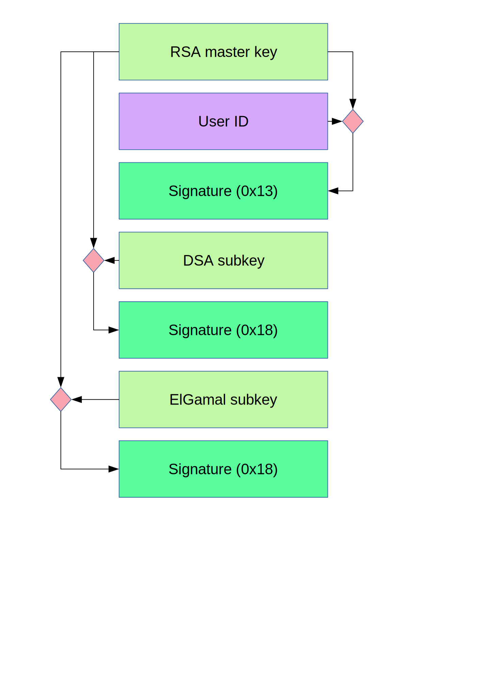

# Anatomy of a secret key keyring

## Using an HEX editor

## Using GPG

Let's dump the content of the PGP document generated by [this example program](../app-pgp-keyring/README.md):

    $ gpg --list-packets --verbose secret-keyring.pgp
    gpg: armor header: Version: BCPG v1.65

The first packet represents a secret key ([tag=5](https://tools.ietf.org/html/rfc4880#section-5.5.1.3)) 
* `algo=1`: [RSA (Encrypt or Sign)](https://tools.ietf.org/html/rfc4880#section-9.1)

Data:
    
    # off=0 ctb=95 tag=5 hlen=3 plen=292
    :secret key packet:
        version 4, algo 1, created 1586792857, expires 0
        pkey[0]: AFCDF449F69F7ED3CD4486CE68EAFDCE3CE23342AEAE4957AB2912F427D4929D186F61E2CCD6E816447EB2E86D1CE8D7C4206C0ECAD669687020BA5138F21073
        pkey[1]: 11
        iter+salt S2K, algo: 9, SHA1 protection, hash: 2, salt: 7A5C134348C03B63
        protect count: 65536 (96)
        protect IV:  5f 86 4d 58 01 ee 02 53 b4 f9 de 8d f6 8c 9d 7c
        skey[2]: [v4 protected]
        keyid: A37C313E3FA6FADC
        
The second packet represents a user ID packet ([tag=13](https://tools.ietf.org/html/rfc4880#section-5.11))

Data:
        
    # off=295 ctb=b4 tag=13 hlen=2 plen=15
    :user ID packet: "denis@email.com"
    
The third packet represents a signature packet ([tag=2](https://tools.ietf.org/html/rfc4880#section-5.2))
* `version 4`: [Version 4 Signature Packet Format](https://tools.ietf.org/html/rfc4880#section-5.2.3)    
* `algo=1`: [RSA (Encrypt or Sign)](https://tools.ietf.org/html/rfc4880#section-9.1)
* `sigclass 0x13`: [Positive certification of a User ID and Public-Key packet](https://tools.ietf.org/html/rfc4880#section-5.2.1)
* `digest algo=2`: [SHA1](https://tools.ietf.org/html/rfc4880#section-9.4) 
* `subpkt 2`: [Signature Creation Time](https://tools.ietf.org/html/rfc4880#section-5.2.3.1)
* `subpkt 16`: [Issuer](https://tools.ietf.org/html/rfc4880#section-5.2.3.1)

Data:

    # off=312 ctb=88 tag=2 hlen=2 plen=92
    :signature packet: algo 1, keyid A37C313E3FA6FADC
        version 4, created 1586792857, md5len 0, sigclass 0x13
        digest algo 2, begin of digest a3 f1
        hashed subpkt 2 len 4 (sig created 2020-04-13)
        subpkt 16 len 8 (issuer key ID A37C313E3FA6FADC)
        data: 829E9C51496169FACDC3059FE8F1F766D046FA6D0B2095BB7C983B29C9DF05261BDBEB4BD7995B1A06E524525638868ADC17CE49D6BC0990FD046E9EAA2C09D7
        
The fourth packet represents a secret sub key ([tag=7](https://tools.ietf.org/html/rfc4880#section-5.5.1.4))
* `algo=17`: [DSA (Digital Signature Algorithm)](https://tools.ietf.org/html/rfc4880#section-9.1)

Data:
        
    # off=406 ctb=9d tag=7 hlen=3 plen=297
    :secret sub key packet:
        version 4, algo 17, created 1586792857, expires 0
        pkey[0]: 87307A03FD4EE055A51D5EFDE3D5E518A48D920E4CA2B9DB9ECDFEEE4CBE5D13882F4DD74F5DDA19FA01FE35F2A60A1ADFA7B60B085AB193C675F9655FCC32DD
        pkey[1]: F3AC18CFEFA9E7626F129294C8CE48099FEC9B0B
        pkey[2]: 043E892E0454B91013EE1317E7311A73575582F5AFE81A4204AB3D2B58A6BBB777AB0B683BCE7F723B093F88EC39E0BA1062B4EBDB31C1CA531B14CB5C4E8E5A
        pkey[3]: 7BE703DEB57CA64E53E4D630B8CEE60C0C22DF170C068EA0BF913A2A2F7584FC96FE41725FCF7D796A140FE055888148FE948F7216CECEB3EB33D6486A39ADFD
        iter+salt S2K, algo: 9, SHA1 protection, hash: 2, salt: 7A5C134348C03B63
        protect count: 65536 (96)
        protect IV:  69 82 7d ba 31 cd 0d 51 12 a3 1e 84 60 5b 57 b7
        skey[4]: [v4 protected]
        keyid: F02A1F4E95231A89
        
The fifth packet represents a signature packet ([tag=2](https://tools.ietf.org/html/rfc4880#section-5.2))
* `version 4`: [Version 4 Signature Packet Format](https://tools.ietf.org/html/rfc4880#section-5.2.3)    
* `algo=1`: [RSA (Encrypt or Sign)](https://tools.ietf.org/html/rfc4880#section-9.1)
* `sigclass 0x18`: [Subkey Binding Signature](https://tools.ietf.org/html/rfc4880#section-5.2.1)
* `digest algo=2`: [SHA1](https://tools.ietf.org/html/rfc4880#section-9.4) 
* `subpkt 2`: [Signature Creation Time](https://tools.ietf.org/html/rfc4880#section-5.2.3.1)
* `subpkt 16`: [Issuer](https://tools.ietf.org/html/rfc4880#section-5.2.3.1)

Data:
        
    # off=706 ctb=88 tag=2 hlen=2 plen=92
    :signature packet: algo 1, keyid A37C313E3FA6FADC
        version 4, created 1586792857, md5len 0, sigclass 0x18
        digest algo 2, begin of digest 1b 4f
        hashed subpkt 2 len 4 (sig created 2020-04-13)
        subpkt 16 len 8 (issuer key ID A37C313E3FA6FADC)
        data: AD4867C165A16A5AF5802E6203A03C2BF4E7C278BB64600766E878A2FA25BC7D85AB5E5CBF34804CDE16BCF0BA5D3517293ABC13FD4DAEE65B8F7F2B2930FC90
        

The sixth represents a secret sub key ([tag=7](https://tools.ietf.org/html/rfc4880#section-5.5.1.4))
* `algo=16`: [Elgamal (Encrypt-Only)](https://tools.ietf.org/html/rfc4880#section-9.1)
     
Data:   
        
    # off=800 ctb=9d tag=7 hlen=3 plen=319
    :secret sub key packet:
        version 4, algo 16, created 1586792857, expires 0
        pkey[0]: 9494FEC095F3B85EE286542B3836FC81A5DD0A0349B4C239DD38744D488CF8E31DB8BCB7D33B41ABB9E5A33CCA9144B1CEF332C94BF0573BF047A3ACA98CDF3B
        pkey[1]: 153D5D6172ADB43045B68AE8E1DE1070B6137005686D29D3D73A7749199681EE5B212C9B96BFDCFA5B20CD5E3FD2044895D609CF9B410B7A0F12CA1CB9A428CC
        pkey[2]: 7234963360D1C4CFE23E8620EB60F6ACC3C833E101D9D8CE9036F441D6BC0D53BBCC5226D5047DC9129A7539BA78FF0950BC3AF91B00214BAE8243F9452149C5
        iter+salt S2K, algo: 9, SHA1 protection, hash: 2, salt: 7A5C134348C03B63
        protect count: 65536 (96)
        protect IV:  56 36 c6 f7 80 d0 47 af 86 fd ca 35 c6 88 28 8e
        skey[3]: [v4 protected]
        keyid: B4CBC3A76A364F91
        

the seventh represents a signature packet ([tag=2](https://tools.ietf.org/html/rfc4880#section-5.2))
* `version 4`: [Version 4 Signature Packet Format](https://tools.ietf.org/html/rfc4880#section-5.2.3)
* `algo=1`: [RSA (Encrypt or Sign)](https://tools.ietf.org/html/rfc4880#section-9.1)
* `sigclass 0x18`: [Subkey Binding Signature](https://tools.ietf.org/html/rfc4880#section-5.2.1)
* `digest algo=2`: [SHA1](https://tools.ietf.org/html/rfc4880#section-9.4) 
* `subpkt 2`: [Signature Creation Time](https://tools.ietf.org/html/rfc4880#section-5.2.3.1)
* `subpkt 16`: [Issuer](https://tools.ietf.org/html/rfc4880#section-5.2.3.1)

Data:
        
    # off=1122 ctb=88 tag=2 hlen=2 plen=92
    :signature packet: algo 1, keyid A37C313E3FA6FADC
        version 4, created 1586792857, md5len 0, sigclass 0x18
        digest algo 2, begin of digest 55 6e
        hashed subpkt 2 len 4 (sig created 2020-04-13)
        subpkt 16 len 8 (issuer key ID A37C313E3FA6FADC)
        data: A33998CEF4B7E587B1A7FD724F32ACE002C9B54E5983FD133BCDAC15B8E50E97436614ADF772B821A552DCB8317718BA58BD4EB991834905AD54173B07044029

Another useful command to print information from the packet:

    $ pgpdump -lmi secret-keyring.pgp
    
