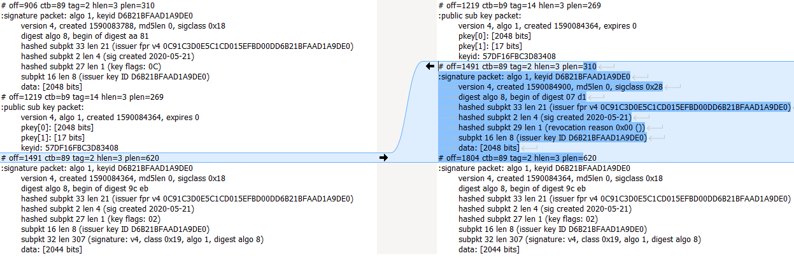

# Anatomy of a key revocation certificate

Let's see what, precisely, is a subkey revocation certificate.

We will use PGP to generate a key (that is a master key and a subkey).
And then, we will generate a revocation certificate for the subkey.

First, create a key. Execute the following command:

    gpg --full-generate-key

Let be:
* `MK`: the ID of the master key.
* `SK1`: the ID of the first subkey.
* `SK2`: the ID of the second subkey.

Under MSDOS:    
    
    SET MK=D6B21BFAAD1A9DE0
    gpg --armor --output pub.key --export %MK%
    gpg --list-packet pub.key
    SET SK1=3B08F736D6E2BDE6
    
Then add a subkey that will be used for signing. The command is `addkey`.

    gpg --edit-key %MK%
    "addkey" [ENTER]
    "4" [ENTER]
    [ENTER]
    "0" [ENTER]
    "o" [ENTER]
    "o" [ENTER]
    "save" [ENTER]
    
OK, a signing subkey has been added. Let's get its ID:
    
    gpg --armor --output pub-before.key --export %MK%
    gpg --list-packet pub-before.key
    SET SK2=57DF16FBC3D83408

Edit the second subkey (which ID is `57DF16FBC3D83408`) in order to revoke it:

    gpg --edit-key %MK%
    "key 57DF16FBC3D83408" [ENTER]
  
> The **VERY IMPORTANT** point here is the selection of the key/subkey to revoke.
> In this case, we select the subkey which ID is `57DF16FBC3D83408`: `"key 57DF16FBC3D83408" [ENTER]`. 
    
Here, you have the following output:

    sec  rsa2048/D6B21BFAAD1A9DE0
         créé : 2020-05-21  expire : jamais      utilisation : SC
         confiance : ultime        validité : ultime
    ssb  rsa2048/3B08F736D6E2BDE6
         créé : 2020-05-21  expire : jamais      utilisation : E
    ssb* rsa2048/57DF16FBC3D83408
         créé : 2020-05-21  expire : jamais      utilisation : S
    [  ultime ] (1). Denis <denis@test4.org>

> Please, notice that **the second subkey is selected** (`ssb* rsa2048/57DF16FBC3D83408`).

    "revkey" [ENTER]
    "o" [ENTER]
    "0" [ENTER]
    [ENTER]
    "o" [ENTER]
    "save" [ENTER]
    
At this point the second subkey is revoked.

Save the structure of the public keyring **before** the revocation:

    gpg --list-packet pub-before.key > before-revocation.txt

Save the structure of the public keyring **after** the revocation:

    gpg --armor --output pub-after.key --export %MK%
    gpg --list-packet pub-after.key > after-revocation.txt
    
OK. Now we just print the changes between the moment we created the key and the moment we revoked it.
The two files to compare are:
* [before-revocation.txt](pgp-packets-subkey-revocation-certificate/before-revocation.txt)
* [after-revocation.txt](pgp-packets-subkey-revocation-certificate/after-revocation.txt)

We note that a [Subkey Revocation Signature Packet ](https://tools.ietf.org/html/rfc4880#section-5.2.1) (tag=2, type=0x28) has been inserted after the 
[Public Subket Packet](https://tools.ietf.org/html/rfc4880#section-5.5.1.2) (tag=14) and before the [Subkey Binding Signature Packet](https://tools.ietf.org/html/rfc4880#section-5.2.1) (tag=2, type=0x18):

    # off=1491 ctb=89 tag=2 hlen=3 plen=310
    :signature packet: algo 1, keyid D6B21BFAAD1A9DE0
        version 4, created 1590084900, md5len 0, sigclass 0x28
        digest algo 8, begin of digest 07 d1
        hashed subpkt 33 len 21 (issuer fpr v4 0C91C3D0E5C1CD015EFBD00DD6B21BFAAD1A9DE0)
        hashed subpkt 2 len 4 (sig created 2020-05-21)
        hashed subpkt 29 len 1 (revocation reason 0x00 ())
        subpkt 16 len 8 (issuer key ID D6B21BFAAD1A9DE0)
        data: [2048 bits]

