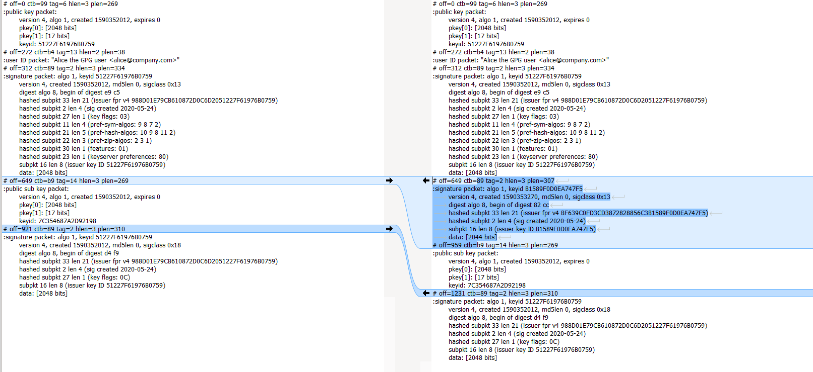
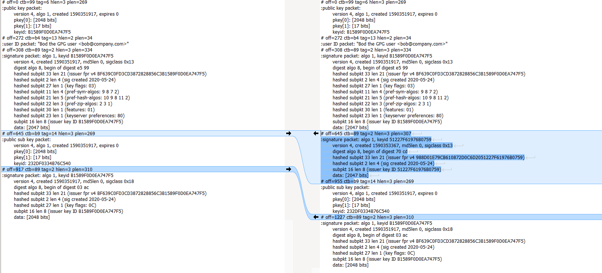

# Web of trust

Let's create 2 keyrings:
* one keyring for Bob.
* ont keyring for Alice.

And let's assume that:

* Bob vouch that Alice's key belongs to Alice by adding my signature to it.
* Alice vouch that Alice's key belongs to Bob by adding my signature to it.

Create the keys for Alice and Bob:

    gpg --full-generate-key

Bob:

    pub   rsa2048 2020-05-24 [SC]
          BF639C0FD3CD3872828856C3B1589F0D0EA747F5
    uid                      Bod the GPG user <bob@company.com>
    sub   rsa2048 2020-05-24 [E]

Alice:

    pub   rsa2048 2020-05-24 [SC]
          988D01E79CB610872D0C6D2051227F61976B0759
    uid                      Alice the GPG user <alice@company.com>
    sub   rsa2048 2020-05-24 [E]

Exportation:

    gpg --armor --output pub-bob.key --export BF639C0FD3CD3872828856C3B1589F0D0EA747F5
    gpg --armor --output sec-bob.key --export-secret-keys BF639C0FD3CD3872828856C3B1589F0D0EA747F5
    gpg --armor --output pub-alice.key --export 988D01E79CB610872D0C6D2051227F61976B0759
    gpg --armor --output sec-alice.key --export-secret-keys 988D01E79CB610872D0C6D2051227F61976B0759
    
Bob signs Alice's public key:

    gpg --sign-key -u bob@company.com --ask-cert-level alice@company.com
    
Alice signs Bob's public key:
    
    gpg --sign-key -u alice@company.com --ask-cert-level bob@company.com

Export the keys again:
    
    gpg --armor --output signed-pub-bob.key --export BF639C0FD3CD3872828856C3B1589F0D0EA747F5
    gpg --armor --output signed-sec-bob.key --export-secret-keys BF639C0FD3CD3872828856C3B1589F0D0EA747F5
    gpg --armor --output signed-pub-alice.key --export 988D01E79CB610872D0C6D2051227F61976B0759
    gpg --armor --output signed-sec-alice.key --export-secret-keys 988D01E79CB610872D0C6D2051227F61976B0759

Export the keys structures before and after the signature process:

    gpg --list-packet pub-bob.key > pub-bob.key.txt
    gpg --list-packet signed-pub-bob.key > signed-pub-bob.key.txt
    gpg --list-packet pub-alice.key > pub-alice.key.txt
    gpg --list-packet signed-pub-alice.key > signed-pub-alice.key.txt
    
Then compare the keys structures before and after the signature process:

[pub-alice.key.txt](pgp-web-of-trust/pub-alice.key.txt) and [signed-pub-alice.key.txt](pgp-web-of-trust/signed-pub-alice.key.txt).

[pub-bob.key.txt](pgp-web-of-trust/pub-bob.key.txt) and [signed-pub-bob.key.txt](pgp-web-of-trust/signed-pub-bob.key.txt).

A [Positive certification of a User ID and Public-Key packet](https://tools.ietf.org/html/rfc4880#section-5.2.1) has been added.

